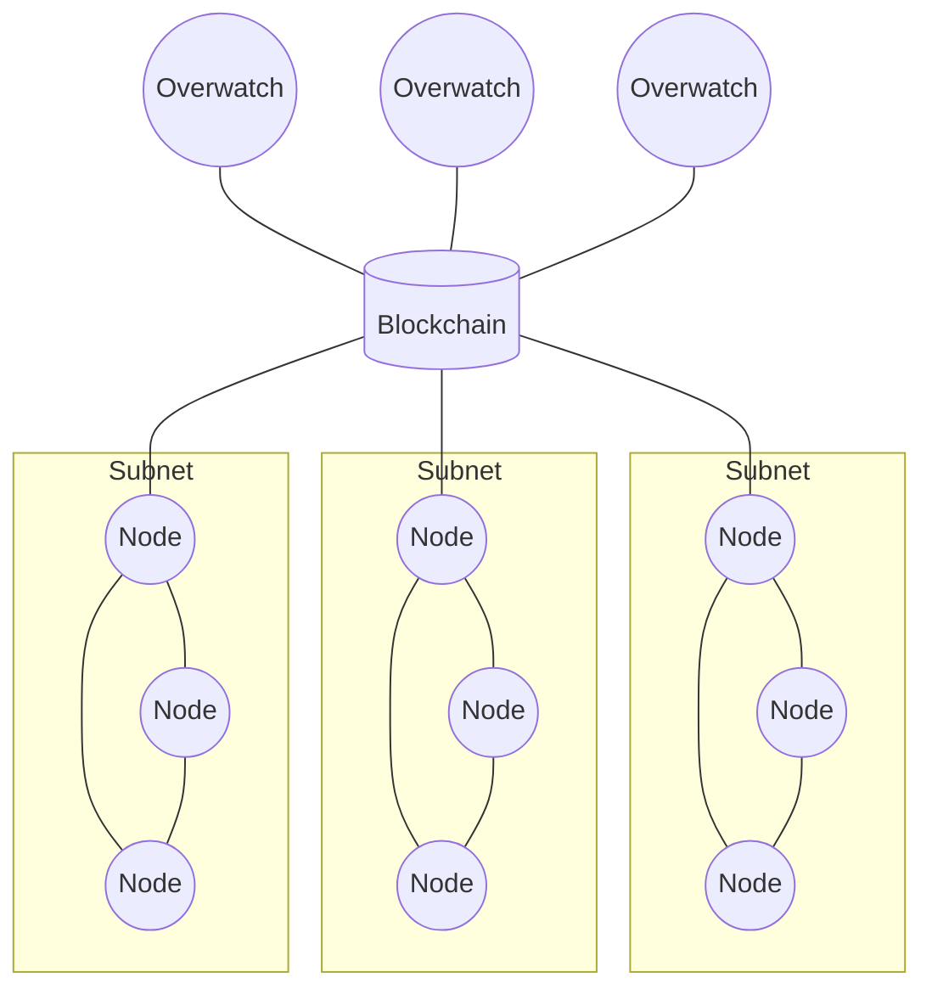

```mermaid
flowchart TB
    O1((Overwatch))
    O2((Overwatch))
    O3((Overwatch))

    B[(Blockchain)]

    O1 --- B
    O2 --- B
    O3 --- B

    B --- S1A
    B --- S2A
    B --- S3A

    subgraph S1[Subnet]
        S1A((Node)) --- S1B((Node))
        S1A --- S1C((Node))
        S1B --- S1C
    end

    subgraph S2[Subnet]
        S2A((Node)) --- S2B((Node))
        S2A --- S2C((Node))
        S2B --- S2C
    end

    subgraph S3[Subnet]
        S3A((Node)) --- S3B((Node))
        S3A --- S3C((Node))
        S3B --- S3C
    end
```
