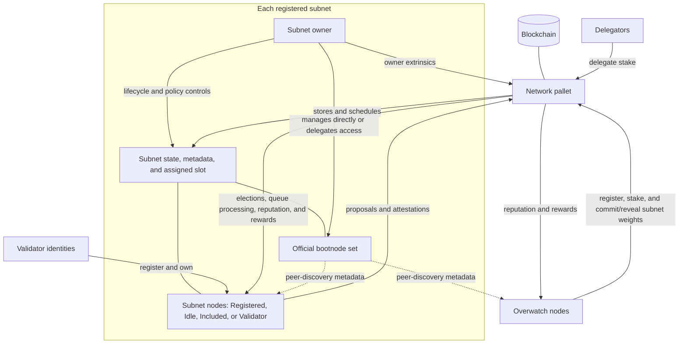

# Network Pallet Architecture

The network pallet manages on-chain roles, subnet lifecycle state, epoch scheduling, consensus,
staking, reputation, and rewards. The diagram shows those logical relationships; it is not a
peer-to-peer topology.

Subnet nodes and overwatch nodes interact with the blockchain through pallet extrinsics. The
pallet stores official bootnode sets and node peer information, but it does not store or require
links between every pair of nodes. In particular, subnet nodes are not required by on-chain logic
to form a full mesh.

Each subnet receives an assigned slot that defines its local epoch boundary. At that slot, the
pallet can settle an allocated exact prior round even if the subnet has since been paused. If the
subnet is `Active`, it attempts a new proposer election once consensus-eligible and stores one when
the effective candidate set is valid and nonempty, then processes its registration queue and
updates its node burn rate. Overwatch nodes run a separate commit-reveal process; finalized
overwatch subnet weights are one input to subnet emission weighting.
