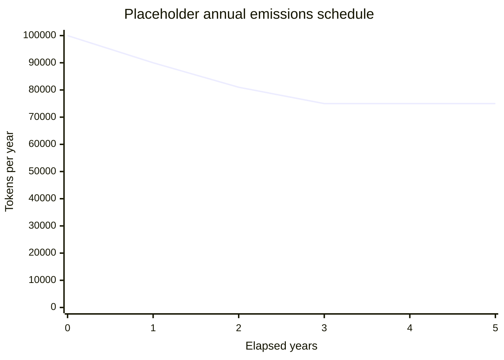
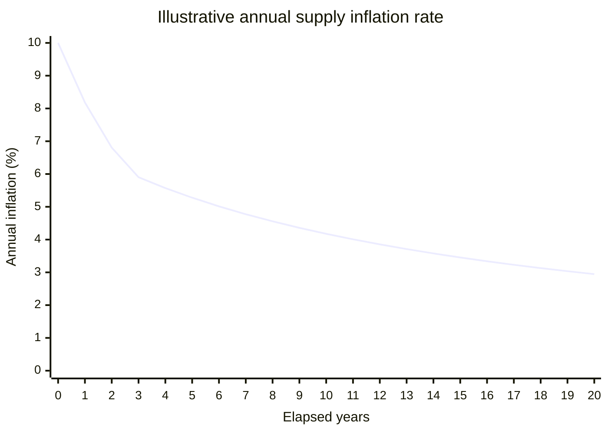
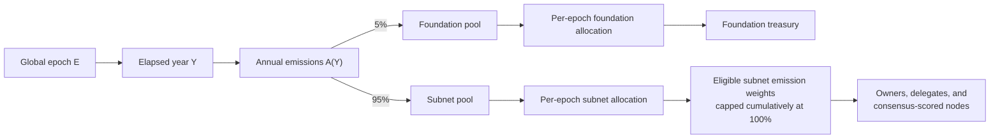

# Inflation

The network uses one deterministic annual emissions schedule. It is independent of subnet count,
node count, and node utilization. Token amounts are launch placeholders; the formula and percentage
split are the mechanism described here.

## Annual schedule

For global epoch `E`:

```text
Y = floor(E / EpochsPerYear)

A(0) = max(initial_annual_emissions, terminal_annual_emissions)
A(Y) = max(terminal_annual_emissions, floor(A(Y - 1) * 90 / 100))
```

Emissions retain 90% of the previous year's amount, a 10% annual decay, until reaching the terminal
floor.



| Elapsed year | Annual emissions |
| ---: | ---: |
| 0 | 100,000 |
| 1 | 90,000 |
| 2 | 81,000 |
| 3+ | 75,000 |

## Annual supply inflation rate

Annual emissions are token amounts, not percentages. Their scheduled annual supply inflation rate
depends on the supply at the start of each year:

```text
inflation_rate(Y) = A(Y) / start_of_year_supply(Y) * 100%
```

This is a supply inflation rate, not staking APR or APY. Staking yield depends on which rewards a
participant is eligible to receive and how those rewards are divided.

The pallet does not define the launch supply, so there is no single percentage curve yet. The chart
below is illustrative: it assumes a 1,000,000-token launch supply, every scheduled emission is
issued, and there are no burns or other sources of issuance.



Under those assumptions, the model is **disinflationary**: supply keeps increasing, but its annual
percentage growth rate keeps falling. Absolute emissions do not decline indefinitely; they remain
at 75,000 tokens per year after year 3. If `S` is the supply when terminal emissions `T` begin, then:

```text
terminal_rate(n) = T / (S + n * T) * 100%  ->  0% as n -> infinity
```

The rate approaches 0% but never becomes deflationary, and there is no maximum supply. Actual
network-wide inflation can differ when an emissions ceiling is not fully issued or when other
minting or burning changes total supply.

## Per-epoch allocation

The annual amount is split 5% to the foundation and 95% to subnet rewards, then each pool is divided
by `EpochsPerYear`.

```text
annual_foundation = floor(A(Y) * 5 / 100)
annual_subnets = A(Y) - annual_foundation

epoch_foundation = floor(annual_foundation / EpochsPerYear)
epoch_subnets = floor(annual_subnets / EpochsPerYear)
```



The elected proposer's fixed validator reward is separate from this emissions budget.

## Issuance rules

- The calculated amounts are issuance ceilings, not guaranteed issuance.
- If an epoch has no eligible subnet emission weights, neither pool is issued and nothing carries
  forward.
- Eligible subnet weights allocate the subnet pool and cannot cumulatively exceed 100%.
- Deterministic integer division can leave at most one atomic unit of the per-epoch budget unissued.
- The foundation share has no separate decay term or time-based cutoff.

The schedule is implemented in [`src/supply/inflation.rs`](src/supply/inflation.rs), and epoch
allocation is applied in [`src/utilities/slot.rs`](src/utilities/slot.rs).
