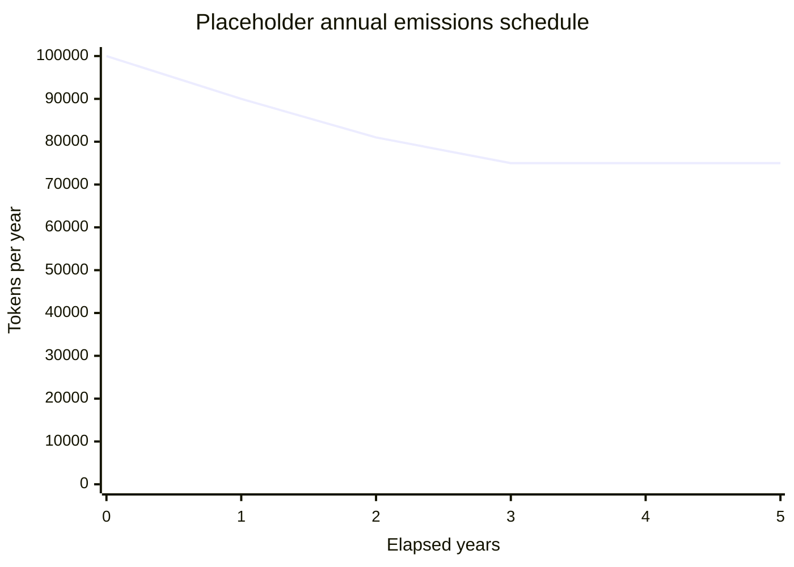
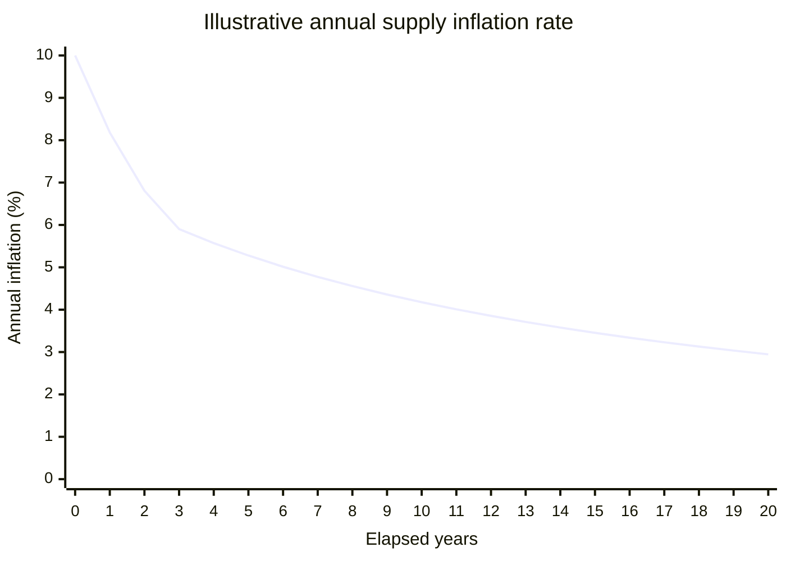
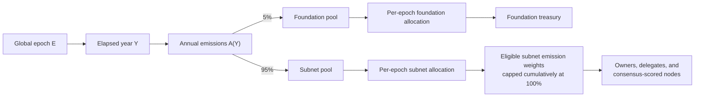

# Inflation

The foundation/subnet reward budget uses one deterministic annual emissions schedule. That budget
is independent of subnet count, node count, and node utilization. Token amounts are launch
placeholders; the formula and percentage split are the mechanism described here.

This schedule is not an exhaustive ceiling on issuance by the network pallet. Successful consensus
can also credit a proposal-validator reward, and completed Overwatch settlements can credit their
separately configured emissions budget. Both are outside `A(Y)` below.

## Annual schedule

For global epoch `E`:

```text
Y = floor(E / EpochsPerYear)

A(0) = max(initial_annual_emissions, terminal_annual_emissions)
A(Y) = max(terminal_annual_emissions, floor(A(Y - 1) * 90 / 100))
```

Emissions retain 90% of the previous year's amount, a 10% annual decay, until reaching the terminal
floor.



| Elapsed year | Annual emissions |
| ---: | ---: |
| 0 | 100,000 |
| 1 | 90,000 |
| 2 | 81,000 |
| 3+ | 75,000 |

## Scheduled contribution to annual supply inflation

`A(Y)` is a token amount, not a percentage. It is the nominal annual budget before the two pools
are divided into integer per-epoch amounts. Its nominal contribution to annual supply inflation
depends on the supply at the start of each year:

```text
nominal_inflation_rate(Y) = A(Y) / start_of_year_supply(Y) * 100%
```

The exact scheduled ceiling is `EpochsPerYear` times the sum of the two per-epoch allocations shown
below, and can be slightly lower than `A(Y)` because atomic-unit division remainders are not issued.

This is not the network pallet's total supply inflation rate, staking APR, or APY. Total inflation
also depends on the separately budgeted proposal-validator and Overwatch rewards. Staking yield
depends on which rewards a participant is eligible to receive and how those rewards are divided.

The pallet does not define the launch supply, so there is no single percentage curve for this
schedule. The chart below is illustrative: it assumes a 1,000,000-token launch supply, uses the
nominal `A(Y)` amounts without atomic-unit division remainders, assumes every eligible
foundation/subnet emission is issued, and excludes burns and other sources of issuance.



Under those assumptions, this schedule is **disinflationary**: supply keeps increasing, but its
annual percentage growth rate keeps falling. Its absolute emissions do not decline indefinitely;
they remain at 75,000 tokens per year after year 3. If `S` is the supply when terminal emissions `T`
begin, then:

```text
terminal_rate(n) = T / (S + n * T) * 100%  ->  0% as n -> infinity
```

The rate approaches 0% but never becomes deflationary, and this nonzero terminal schedule does not
impose a maximum supply. Actual network-wide inflation can differ when this ceiling is not fully
issued, when the separate validator or Overwatch rewards are credited, or when other minting or
burning changes total supply.

## Per-epoch allocation

The annual amount is split 5% to the foundation and 95% to subnet rewards, then each pool is divided
by `EpochsPerYear`.

```text
annual_foundation = floor(A(Y) * 5 / 100)
annual_subnets = A(Y) - annual_foundation

epoch_foundation = floor(annual_foundation / EpochsPerYear)
epoch_subnets = floor(annual_subnets / EpochsPerYear)
```



The proposal-validator reward is separate from this emissions budget. It is not fixed: when an
allocated round is settled, both the stake and distinct-validator-identity quorums pass, and the
elected node retains its canonical validator link, the pallet credits
`floor(base_validator_reward * validator_reward_factor / 1e18)` to the proposer's node stake. The
factor is snapshotted from the proposal's epoch progress. A completed Overwatch interval likewise
uses a separate budget:

```text
overwatch_interval_budget = saturating_mul(
    OverwatchEpochEmissions,
    completed_interval_multiplier
)
```

That budget is distributed by normalized Overwatch scores only when the interval has a nonzero
total final score. At interval close, the pallet snapshots this exact budget together with the
stake-weight exponent and each canonical revealing Overwatch node's raw stake. Delayed settlement
uses that same-epoch snapshot and reveal rows, never current stake or exponent. A missing snapshot
leaves settlement pending. Removing a node before settlement purges its pending reveal row and
snapshot entry, so it receives no score or reward from that interval; if it was the last pending
participant, the interval finalizes explicitly empty. Successful settlement consumes the pending
header and snapshot exactly once. Removal after finalization does not reverse rewards already
credited or rewrite historical score outputs.

Finalization also publishes a latest-only effective Overwatch signal for future subnet-emission
allocation. Removing a finalized participant recomputes that signal from the retained close-time
stakes and reveals, because global stake normalization makes simple aggregate subtraction
incorrect. If those retained inputs cannot be validated, allocation fails closed to the configured
default Overwatch subnet weight rather than reading stale historical weights. An allocation already
stored in `FinalSubnetEmissionWeights` remains final; the revised signal first affects the next
slot-2 allocation that has not yet run.

## Issuance rules

- The calculated foundation/subnet amounts are issuance ceilings, not guaranteed issuance.
- If an epoch has no eligible subnet emission weights, neither scheduled pool is issued and nothing
  carries forward. If the weight map is nonempty, the foundation allocation is issued immediately;
  later failures to settle subnet rewards do not reverse it.
- Eligible subnet weights allocate the subnet pool and cannot cumulatively exceed 100%.
- At the schedule-split stage,
  `floor(annual_subnets / EpochsPerYear) + floor(annual_foundation / EpochsPerYear)` is at most one
  atomic unit below `floor(A(Y) / EpochsPerYear)`. That bound does not cover later normalization and
  reward rounding or forfeited allocations: missing or failed consensus, an accepted zero-score
  round, and node reward factors can leave additional subnet budget unissued.
- The foundation share has no separate decay term or time-based cutoff.

The schedule is implemented in [`src/supply/inflation.rs`](src/supply/inflation.rs), and epoch
allocation is applied in [`src/utilities/slot.rs`](src/utilities/slot.rs).
