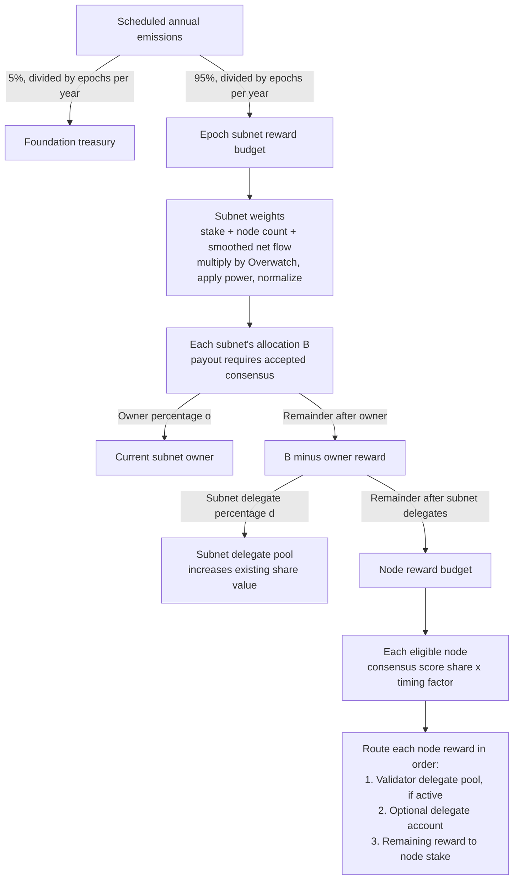

# Rewards

Emissions pass through three allocation layers: the chain's scheduled subnet budget, each subnet's share of that budget, and the recipients inside that subnet. Subnet allocation uses **delegate stake, eligible node count, and smoothed delegate-stake net flow**, multiplied by an **Overwatch weight**, then adjusted by a **distribution power** and normalized across eligible subnets.

Within a subnet, the owner receives a percentage first. Subnet delegators receive a configured percentage of the remainder, and the remaining node budget is divided by accepted consensus scores. Each node's reward can then be reduced by its attestation timing factor and shared with
its validator's delegators and optional delegate account.

## Allocation flow



The diagram shows budget allocation; actual credits depend on the conditions below. The foundation allocation requires a nonempty subnet-weight map. Proposal-validator bonuses and Overwatch-node rewards have separate budgets and are described under [Additional rewards](#additional-rewards).

## 1. Scheduled emissions become an epoch budget

The annual schedule reserves 5% for the foundation and 95% for subnets. Each annual pool is divided by `EpochsPerYear`, with integer rounding down, to produce its per-epoch budget. See [INFLATION.md](INFLATION.md) for the decay schedule and token amounts.

`handle_subnet_emission_weights` calculates subnet weights and stores them with that epoch's subnet budget in `FinalSubnetEmissionWeights`. If the weight map is nonempty, it also attempts to credit the foundation treasury. If the map is empty, neither scheduled pool is credited for that epoch. Later subnet consensus failures do not reverse an already credited foundation allocation.

## 2. The epoch subnet budget is divided across subnets

Only subnets with an exact elected consensus round for the epoch being settled participate. Preparing subnets without that election do not dilute the denominators. A subnet paused after its election can still receive the allocation for that historical round. In the normal schedule, global epoch `G` allocates rewards for subnet round `G - 1`, which settles at the subnet's slot.

For each eligible subnet `s`, the inputs are:

| Input | What is measured |
| --- | --- |
| Delegate-stake share `D_s` | The subnet's `TotalSubnetDelegateStakeBalance` divided by the total for eligible subnets. This is delegation to the subnet, separate from delegation to validator identities or direct node stake. |
| Node-count share `C_s` | The number of eligible node IDs in the stored election round divided by their total across eligible subnets. This is the election's candidate count, not every registered or active node. |
| Smoothed net-flow weight `F_s` | A relative, smoothed measure of deposits into minus withdrawals from subnet delegate stake. Reward credits do not count as new inflow. |
| Overwatch multiplier `O_s` | The latest valid effective Overwatch subnet signal, scaled by `OverwatchWeightFactor` and capped at 100%; otherwise `DefaultOverwatchSubnetWeight`. An explicit zero signal stays zero. |

Using ordinary fractions, the allocation formula is:

```text
base_s     = delegate_stake_factor * D_s
           + node_count_factor     * C_s
           + net_flow_factor       * F_s
adjusted_s = clamp(base_s * O_s, 0, 1) ^ SubnetDistributionPower
weight_s   = adjusted_s / sum(adjusted values for eligible subnets)
budget_s   = floor(epoch_subnet_budget * weight_s)
```

A zero total delegate balance or node count gives a zero share for that input. If there is no positive finite total adjusted weight, there is no allocation. Stored weights use `1e18 = 100%`;
conversion and a cumulative cap ensure their sum cannot exceed 100%.

The current storage defaults are:

| Parameter | Default | Effect |
| --- | ---: | --- |
| `SubnetWeightFactors.delegate_stake` | 40% | Contribution of relative subnet delegation. |
| `SubnetWeightFactors.node_count` | 40% | Contribution of the eligible node count. |
| `SubnetWeightFactors.net_flow` | 20% | Contribution of smoothed relative delegation flow. |
| `SubnetNetFlowSmoothingAlpha` | 25% | Blend 25% of this epoch's flow weight with 75% of its previous smoothed weight. |
| `OverwatchWeightFactor` | 50% | Scale an available raw Overwatch signal before applying it. |
| `DefaultOverwatchSubnetWeight` | 50% | Use directly when the effective signal is missing, invalid, or has no entry for this subnet. |
| `SubnetDistributionPower` | 0.75 | Compress differences between positive combined weights before normalization. |

These are configurable defaults, not fixed percentages of the final token budget. For example, the same positive Overwatch multiplier applied to every subnet cancels during normalization;
relative differences between subnets affect their allocations.

Net flow is calculated relative to the same eligible cohort. The pallet subtracts the lowest eligible subnet's raw flow from every eligible flow, normalizes those shifted values, and blends
the resulting weight with its previous smoothed weight:

```text
shifted_s      = flow_s - min(eligible flows)
current_flow_s = shifted_s / sum(shifted flows)       # zero if the sum is zero
F_s            = alpha * current_flow_s + (1 - alpha) * previous_F_s
```

Thus even a net withdrawal can score above a larger net withdrawal elsewhere. Equal flows produce zero current weights and decay previous smoothed weights. Raw flow counters reset at allocation; ineligible subnets also lose their stored smoothed weight.

The raw Overwatch signal aggregates revealed subnet weights using normalized Overwatch-node stake weights, with their own `OverwatchStakeWeightFactor` exponent. It uses the retained close-time inputs of finalized Overwatch work. Future allocations read the latest effective signal; allocations already stored in `FinalSubnetEmissionWeights` are not recalculated. See [Overwatch epochs](CONSENSUS.md#overwatch-epochs) for settlement details.

There is no additional direct subnet-reputation or direct node-stake term in this allocation
formula. Those values can affect eligibility, consensus, penalties, and continued participation.

## 3. Each subnet allocation is split between owner, delegates, and nodes

Let `B` be the subnet's allocation, `o` its round's network-wide `SubnetOwnerPercentage`, and `d`
its round's subnet-specific `SubnetDelegateStakeRewardsPercentage`:

```text
owner_reward          = floor(B * o)
after_owner           = B - owner_reward
subnet_delegate_reward = floor(after_owner * d)
node_budget           = after_owner - subnet_delegate_reward
```

These three allocations sum exactly to `B` before payout eligibility and node-level rounding. The delegate percentage applies to the **remainder after the owner**, not to the original subnet allocation. The current owner default is 23%; the delegate percentage is configured per subnet
(its storage default is 10%). Settlement uses the consensus round's snapshotted percentages.

| Recipient | How the reward is credited |
| --- | --- |
| Subnet owner | A balance credit to the current `SubnetOwner` account. |
| Subnet delegators | Increase the subnet delegate pool's balance without issuing new shares, increasing the value of existing shares. The pool must have user-circulating shares. |
| Subnet nodes | Divide `node_budget` by consensus score, apply participation and eligibility rules, then route each node reward as described below. |

A subnet delegate pool with no circulating user shares receives nothing, even if locked minimum-liquidity shares remain. Its allocation is not redirected to the owner or nodes.

## 4. Consensus scores determine individual node rewards

The elected proposer submits node scores, and the round must pass both the stake-weighted attestation quorum and the distinct-validator-identity quorum, including its minimum identity-set requirement. The accepted canonical score sum supplies the denominator:

```text
node_score_share = node_score / sum(canonical submitted scores)
gross_node_reward = node_budget * node_score_share * node_reward_factor
```

The implementation represents shares and factors at `1e18` precision and rounds down at each division or multiplication. Consensus attestation weights determine whether the proposal passes; the accepted node scores determine each node's share of rewards.

In normal operation, live Idle and Included nodes pass through graduation rules before becoming rewarded Validator-class nodes. Merely appearing in the score vector does not guarantee payment. Nodes absent from the score vector, with zero score, or quarantined for removal receive no node reward. Reputation checks can quarantine a node during settlement. Emergency validator sets alter the usual graduation and attestation handling; settlement uses the historical submission snapshot
and can also credit a departed node for an otherwise eligible historical contribution.

An attesting node uses its stored timing factor: later attestation can reduce its reward. The proposer's automatic attestation has a 100% factor for its score-based node reward. A node without an attestation currently defaults to a 100% factor, although identity-supermajority endorsement can cause a reputation penalty and possible removal. Emergency nodes outside the temporary validator set also use 100%. Reduced or skipped node rewards are not redistributed to other nodes, and the score denominator is not recomputed to exclude unpaid nodes.

## 5. A node reward can be shared again

The node's validator identity controls two further destinations. These are separate from the subnet-wide delegate reward in step 3. For gross node reward `R`, validator delegate rate `v`, and optional delegate-account rate `a`, routing happens in this order:

```text
validator_pool_reward = floor(R * v)                 # only with circulating user shares
after_validator_pool  = R - validator_pool_reward
delegate_account_reward = floor(after_validator_pool * a)  # only if configured
node_stake_reward     = after_validator_pool - delegate_account_reward
```

If the validator pool has no circulating user shares, its deduction is zero and that amount stays in the node reward. If no delegate account is configured, that deduction is also zero. Validator pool credits increase existing share value; delegate-account credits increase `DelegateAccountStake`;
the remainder increases `NodeSubnetStake`. These are stake/accounting credits rather than immediate wallet payouts. The three credits for an individual node are applied atomically.

## Worked example

Assume the **subnet pool after the foundation split** is 10,000 tokens for the epoch, and one subnet's normalized allocation weight is 20%. Its budget is 2,000 tokens. With a 23% owner rate and a 10% subnet delegate rate:

| Allocation | Calculation | Tokens |
| --- | --- | ---: |
| Owner | `2,000 * 23%` | 460 |
| Subnet delegate pool | `(2,000 - 460) * 10%` | 154 |
| Node budget | `2,000 - 460 - 154` | 1,386 |

If three reward-eligible nodes have scores `3 : 2 : 1` and 100% reward factors, their gross rewards are **693, 462, and 231** tokens. If the first node's validator delegates receive 20%, and its delegate account receives 10% of the remainder, the 693 tokens become:

| Destination | Tokens |
| --- | ---: |
| Validator delegate pool | 138.6 |
| Delegate account | 55.44 |
| Node stake | 498.96 |

The example assumes accepted consensus, active delegate pools, and successful credits. Separate proposal-validator and Overwatch rewards are excluded.

## Additional rewards

Two rewards sit outside the scheduled foundation/subnet budget:

- **Proposal-validator reward:** an accepted, allocated round can additionally credit
  `BaseValidatorReward * validator_reward_factor` directly to the elected proposer's node stake. The factor depends on proposal timing and is separate from its score-based node reward. The
  proposer must retain its canonical validator link and avoid quarantine; a round without a
  positive emission allocation does not receive this bonus. This bonus does not pass through the node's delegate-pool or delegate-account split.
- **Overwatch-node rewards:** a completed Overwatch interval snapshots
  `OverwatchEpochEmissions * interval_multiplier` as its separate budget. Nonzero final Overwatch scores are normalized to allocate that budget to Overwatch-node stake. This compensates Overwatch participation separately from its influence on subnet weights.

## When allocated rewards remain uncredited

Allocation is a ceiling, not a guaranteed payout. Missing proposals or failed consensus quorums do not pay subnet rewards. An **accepted zero-score round** still pays the owner and an active subnet delegate pool, and can pay an eligible proposer bonus, but pays no score-based node rewards. Inactive pools, node eligibility checks, timing reductions, and rounding can leave further budget uncredited. These unused amounts are neither redistributed nor carried forward to a later epoch.

## Implementation references

- [Annual emissions and foundation split](src/supply/inflation.rs): `get_epoch_emissions`.
- [Subnet weights and reward budgets](src/utilities/slot.rs): `calculate_subnet_weights`,
  `get_net_flow_weights_for_eligible`, `checked_subnet_reward_split`, and `emission_settlement_step`.
- [Consensus reward distribution](src/bank/rewards.rs): `distribute_rewards_for_round`,
  `handle_subnet_delegate_stake_reward`, and `handle_validator_delegate_stake`.
- [Consensus scores and timing factors](src/consensus/attestation/subnet_validator.rs):
  canonicalization and the validator/attestor reward multiplier functions.
- [Round policy snapshots](src/utilities/era.rs): `consensus_policy_snapshot`.
- [Storage defaults and configuration](src/lib.rs): reward percentages and subnet weight factors.
